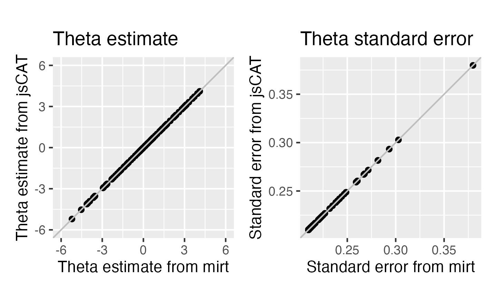

[](https://github.com/yeatmanlab/jsCAT/actions/workflows/ci.yml)
[](https://coveralls.io/github/yeatmanlab/jsCAT?branch=main)
[](https://badge.fury.io/js/@bdelab%2Fjscat)

# jsCAT: Computer Adaptive Testing in JavaScript

A library to support IRT-based computer adaptive testing in JavaScript

## Installation

You can install jsCAT from npm with

```bash
npm i @bdelab/jscat
```

## Usage

```js
// import jsCAT
import { Cat, normal } from '@bdelab/jscat';

// declare prior if you choose to use EAP method
const currentPrior = normal();

// create a Cat object 
const cat = new CAT({method: 'MLE', itemSelect: 'MFI', nStartItems: 0, theta: 0, minTheta: -6, maxTheta: 6, prior: currentPrior})

// update the abilitiy estimate by adding test items 
cat.updateAbilityEstimate(zeta, answer);

const currentTheta = cat.theta;

const currentSeMeasurement = cat.seMeasurement;

const numItems = cat.nItems;

// find the next available item from an input array of stimuli based on a selection method

const stimuli = [{difficulty: -3, item: 'item1'}, {difficulty: -2,  item: 'item2'}];

const nextItem = cat.findNextItem(stimuli, 'MFI');
```

## Validations
### Validation of theta estimate and theta standard error
Reference software: mirt (Chalmers, 2012)


### Validation of MFI algorithm 
Reference software: catR (Magis et al., 2017)


## References
Chalmers, R. P. (2012). mirt: A multidimensional item response theory package for the R environment. Journal of Statistical Software.

Magis, D., & Barrada, J. R. (2017). Computerized adaptive testing with R: Recent updates of the package catR. Journal of Statistical Software, 76, 1-19.

Lucas Duailibe, irt-js, (2019), GitHub repository, https://github.com/geekie/irt-js

## License
jsCAT is distributed under the [ISC license](LICENSE).

## Citation 
If you are use jsCAT for your web applications, please cite us:
Ma, W. A., Richie-Halford, A., Burkhardt, A. K., Kanopka, K., Chou, C., Domingue, B. W., & Yeatman, J. D. (2025). ROAR-CAT: Rapid Online Assessment of Reading ability with Computerized Adaptive Testing. Behavior Research Methods, 57(1), 1-17. https://doi.org/10.3758/s13428-024-02578-y

@article{ma2025roar,
  title={ROAR-CAT: Rapid Online Assessment of Reading ability with Computerized Adaptive Testing},
  author={Ma, Wanjing Anya and Richie-Halford, Adam and Burkhardt, Amy K and Kanopka, Klint and Chou, Clementine and Domingue, Benjamin W and Yeatman, Jason D},
  journal={Behavior Research Methods},
  volume={57},
  number={1},
  pages={1--17},
  year={2025},
  publisher={Springer}
}
